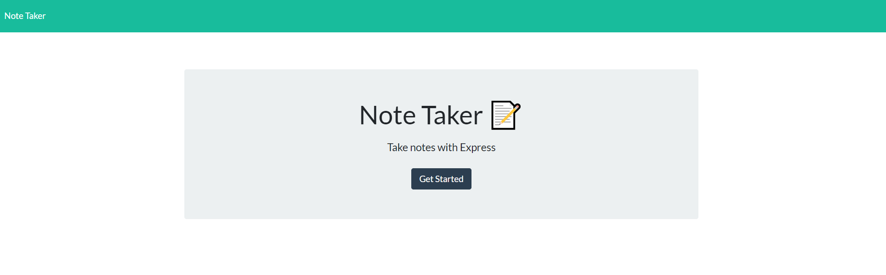

# <em> Note-taker 
 

## <em> Deploy Link
 https://cryptic-dawn-28436.herokuapp.com/
 

## <em> Badges

      

## <em> Description 
Note-taker is an application where users can add a note title and a note text. The notes that the user saved will then appear on the right side of the application and if users decide to delete the notes that they created, then they can click the red delete icon next to each note. 
 

## Visuals

 - Welcome page 

 - Users add their notes within the text section

 - Example of added notes

 - json file where notes are saved

## <em> License
[MIT](./license.md)

